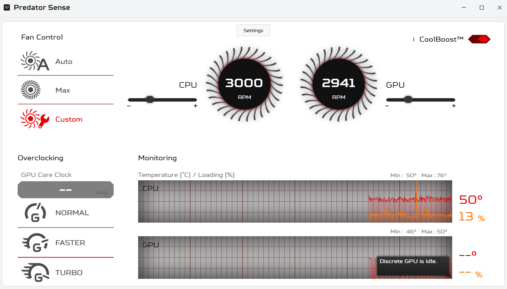

# PredatorSenseDecomp

## Repository Layout

- `src/` - Source projects (`PredatorSense`, `TsDotNetLib`)
- `installer/` - Inno Setup installer script
- `libs/` - External runtime binaries used by predator sense

## New Features

- Windows 11 support + bugfixes
- Fan Curve Modifier
- Dark/light skin
- Ported to latest .NET version
- Modern WPF UI (will be replaced with WinUI in the near future)
- Open-Source

## Future Plans

- Add profiles to fan curve
- x64 support
- Replace WPF with WinUI
- Expand compatibility for other predator models
- Manual GPU Overlock
- Add CPU Overclock

## Installation

### Prerequisites

- .NET 10 Runtime (This should be automatically installed during installation, but if the application does not render please try installing manually) [Download](https://dotnet.microsoft.com/en-us/download/dotnet/10.0)

### Setup

1. If you have a previous installation of Predator Sense, please uninstall before installing this version. 

2. Download & install the latest release from this GitHub page (very important, contains a lot of bug fixes!)

### Issues

If you have any other issues please open an issue on GitHub.

## Note for Acer

Sorry to decompile your software, but you took down the download from the driver page.
